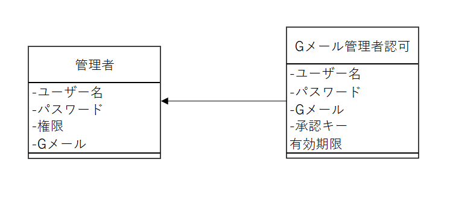
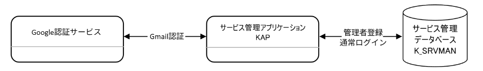

# 概要仕様書

## ユースケース

### 加入者情報管理機能

**加入者を登録する**

主アクター
:   管理者

事前条件
:   なし

主シナリオ
:   1. 管理者は、加入者登録画面を表示する。
    2. サービス管理システムは、加入者登録画面を表示する。
    3. 管理者は加入者情報を登録する。
    4. サービス管理システムは、加入者情報を保存する。
    5. 管理者は、加入者情報を確認する。

拡張シナリオ
:   4a. サービス管理システムは入力エラーを表示する。

成功時保証
:   加入者情報がデータベースに登録される

---

**加入者を編集する**

主アクター
:   管理者

事前条件
:   加入者情報が登録済みであること

主シナリオ
:   1. 管理者は、加入者情報を検索する。
    2. サービス管理システムは、加入者情報の一覧を名前基準に昇順で表示する。
    3. 管理者は、一覧から対象の加入者を選択する。
    4. サービス管理システムは加入者情報を表示する。
    5. 管理者は、加入者情報を修正する。
    6. サービス管理システムは、加入者情報を保存する。
    7. 管理者は、加入者情報を確認する。

拡張シナリオ
:   6a. サービス管理システムは入力エラーを表示する。

成功時保証
:   加入者情報が更新される

---

**加入者を削除する**

主アクター
:   管理者

事前条件
:   加入者情報が登録済みであること

主シナリオ
:   1. 管理者は、加入者情報を検索する。
    2. サービス管理システムは、加入者情報の一覧を名前基準に昇順で表示する。
    3. 管理者は、一覧から対象の加入者を選択する。
    4. サービス管理システムは加入者情報を表示する。
    5. 管理者は、加入者情報を削除する。
    6. サービス管理システムは、加入者情報を保存する。
    7. 管理者は、加入者情報を確認する。

拡張シナリオ
:   6a. サービス管理システムは入力エラーを表示する。

成功時保証
:   加入者情報が削除される

### 料金管理機能

**料金情報を登録する**

主アクター
:   管理者

事前条件
:   登録対象が登録されていないこと

主シナリオ
:   1. 管理者は、基本料金登録画面を表示する。
    2. サービス管理システムは、基本料金登録画面を表示する。
    3. 管理者は料金情報を登録する。
    4. サービス管理システムは、料金情報を保存する。
    5. 管理者は、料金情報を確認する。

拡張シナリオ
:   4a. サービス管理システムは入力エラーを表示する。

成功時保証
:   料金情報がデータベースに登録される

---

**料金情報を編集する**

主アクター
:   管理者

事前条件
:   料金情報が登録済みであること

主シナリオ
:   1. 管理者は、料金情報を検索する。
    2. サービス管理システムは、料金情報の一覧を名前基準に昇順で表示する。
    3. 管理者は、一覧から対象の基本料金を選択する。
    4. サービス管理システムは料金情報を表示する。
    5. 管理者は、料金情報を修正する。
    6. サービス管理システムは、料金情報を保存する。
    7. 管理者は、料金情報を確認する。

拡張シナリオ
:   6a. サービス管理システムは入力エラーを表示する。

成功時保証
:   料金情報が更新される

---

**料金情報を削除する**

主アクター
:   管理者

事前条件
:   料金情報が登録済みであること

主シナリオ
:   1. 管理者は、料金情報を検索する。
    2. サービス管理システムは、料金情報の一覧を名前基準に昇順で表示する。
    3. 管理者は、一覧から対象の基本料金を選択する。
    4. サービス管理システムは料金情報を表示する。
    5. 管理者は、料金情報を削除する。
    6. サービス管理システムは、料金情報を保存する。
    7. 管理者は、料金情報を確認する。

拡張シナリオ
:   6a. サービス管理システムは入力エラーを表示する。

成功時保証
:   料金情報が削除される

### 請求データ作成機能

**請求データを作成する**

主アクター
:   サービス管理システム

事前条件
:   このユースケースは毎月1日に1回実行されること

主シナリオ
:   1. サービス管理システムは、加入者ごと基本料金と追加オプション料金を集計し、請求データを作成する。
    2. 請求データおよび請求明細データテーブルにトランザクションとしてレコード追加する。
    3. サービス管理システムはトランザクションを確定する。

拡張シナリオ
:   2a. 処理中にエラーが発生した場合は中断し、トランザクションを破棄する。

成功時保証
:   当月分の請求データおよび請求明細データが作成される

### ログイン機能

**管理者が通常ログインする**

主アクター
:   管理者

事前条件
:   管理者情報が登録済みである

主シナリオ
:   
    1. 管理者はログイン画面を表示する。 
    2. サービス管理システムはログイン画面を表示する。 
    3. 管理者はユーザー名とパスワードを入力してログインボタンをクリックする。 
    4. サービス管理システムは認証を実施する。 
    5. サービス管理シスムテはメイン画面を表示する。

拡張シナリオ
:   4a. ユーザー名またはパスワードが不正な場合エラーメッセージを表示する。

成功時保証
:   メイン画面に遷移される

---

**管理者がGoogle認証を使ってログインする**

主アクター
:   管理者

事前条件
:   Gメール認証を使う管理者情報が登録済みである

主シナリオ
:   
    1. 管理者はログイン画面を表示する。 
    2. 管理者はGoogleでログインボタンをクリックする。 
    3. サービス管理システムはGoogle認証画面へ遷移する。 
    4. 管理者はGoogleアカウントを選択して認証を行う。 
    5. Google認証サービスは認証を実施する。 
    6. 管理システムはGoogle認証結果を取得する。 
    7. 管理システムは取得したメールアドレスを利用者情報と照合し、利用可否を判定する。 
    8. サービス管理シスムテはトップ画面を表示する。 

拡張シナリオ
:   7a. Google認証に失敗した場合Google認証システムは認証失敗を表示する。

成功時保証
:   メイン画面に遷移される

### Gmail認証ユーザー登録機能

主アクター
:   管理者

事前条件
:   なし

主シナリオ
:   1. 管理者は引数でユーザー名、パスワード、Gメールを指定してGmail認証ユーザー登録機能を実行する。
    2. サービス管理システムはトークンを発行する。
    3. サービス管理システムは、トークンと登録者情報をGmail管理者登録テーブルにレコード追加する。
    4. サービス管理システムは指定したGメールアドレスへ認証をURLを送信する。
    5. 管理者は発行されたトークンをコンソールで目視する。
    5. 管理者は受信した認証URLへアクセスする。
    6. 管理者は、URLアクセス先で発行されたトークンを入力する。
    7. サービス管理システムはトークン、有効期限、試行回数を検証する。
    8. サービス管理システムは、ユーザー情報を登録する。
    9. 管理者はユーザー情報を確認する。

拡張シナリオ
:   7a. トークンが不正な場合、サービス管理システムはエラーメッセージを表示する。
    7b. トークンの有効期限が切れている場合、サービス管理システムはエラーメッセージを表示する。
    7c. トークン3回間違えた場合、サービス管理システムはエラーメッセージを表示して、トークン再発行を行う。

成功時保障
:   登録情報が管理者情報テーブルに登録される。

## 概念モデル

ソース：[Java研修.drawio] → 概念モデルシート

## 外部設計

### サービス管理システムの関係性

- 全ての情報は、サービス管理データベース(K_SRVMAN)の各テーブルに格納される。

- データの閲覧、登録、修正は「サービス管理アプリケーション(KAP)」にて行う。

- 月次、日次など定期的に行う一括処理は「サービス管理バッチ処理(KBT)」にて行う。

### ログインシステムの関係性

- ユーザー情報およびGメール認証ユーザーは、サービス管理データベース(K_SRVMAN)の各テーブルに格納される。

- 通常ログイン、Google認証を使うユーザーの登録は「サービス管理アプリケーション(KAP)」にて行う。

- Google認証によるログインは「Google認証サービス」にて行う。

### サービス管理アプリケーションのフロー

- 未ログインの場合は、各画面を表示する前にログイン画面を表示する。

- 画面上部の機能メニューからトップ画面や各情報の検索画面へ遷移できる。なお、画面に入力したデータは、画面が遷移するとすべて失われる。

### バッチ

詳細は[請求データ作成バッチ仕様書](03_batch_spec.md)を参照。

### データベース設計

#### ER図

#### テーブル定義

各テーブルの項目定義などの物理設計は、[データベーステーブル設計書](09_dbtable.md)を参照。
